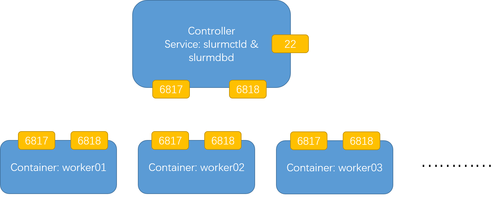

# Slurm in container with containers
Use [Docker](https://www.docker.com/) to explore slurm and [SingularityCE](https://github.com/sylabs/singularity/) containers in a basic slurm cluster test environment.

## TL;DR
```bash
git clone https://github.com/fortis931w/slurm-in-docker.git && cd slurm-in-docker 
make 
docker-compose up -d
docker exec -it controller su
# And enjoy the slurm cluster o(*￣▽￣*)ブ!
```
It will build up with 
- [Slurm 21.08.8-2](https://slurm.schedmd.com) - installed from [rpm packages](packages)
- [OpenMPI 4.1.4](https://www.open-mpi.org/doc/v4.1/) - installed from [rpm packages](packages)
- [Munge 0.5.14](https://github.com/dun/munge) - installed from [rpm packages](packages)
- [Singularity 3.10.0](https://github.com/sylabs/singularity)  - installed from [rpm packages](https://github.com/sylabs/singularity/releases)

## TL;DR 2
```bash
SLURM_SINGULARITY_DEBUG=true SLURM_SINGULARITY_GLOBAL=--silent \
      srun --singularity-container=/tmp/debian10.sif \
           --singularity-bind=/srv \
           --singularity-args="--no-home" \
           -- /bin/grep -i pretty /etc/os-release
```
This docker cluster is integrated with [Singularity](https://github.com/sylabs/singularity) and [Singularity spank plugin](https://github.com/Fortis931w/slurm-singularity-exec.git).

## Containers 


The containers created by the docker-compose are listed.

Container Name | Hostname 
:-------- | :------- 
controller | balthasar.magi
worker01 | casper01.magi
worker02 | casper02.magi
worker03 | casper03.magi

Each worker container is configured with 1800MB memory in [`/etc/slurm/slurm.conf`](controller/entrypoint.sh#L268). The containers store configuration files in `secret` after successfully startup. Containers share storage spaces among them through volumes `storage` and linked to `/home/worker` in containers.

## Image Build

For the first execution, if the folder `packages/rpms` does not exist, `make` will build container `rpmbuilder` to build all the required rpm packages for base image.
```console
ls -la packages/rpms/
total 71188
drwxr-xr-x 2 root   root       4096 Jun  2 01:58 .
drwxrwxr-x 3 root   root       4096 Jun  2 01:58 ..
-rw-r--r-- 1 root   root     135316 Jun  2 01:16 munge-0.5.14-1.el7.x86_64.rpm
-rw-r--r-- 1 root   root     332516 Jun  2 01:16 munge-debuginfo-0.5.14-1.el7.x86_64.rpm
-rw-r--r-- 1 root   root      18352 Jun  2 01:16 munge-devel-0.5.14-1.el7.x86_64.rpm
-rw-r--r-- 1 root   root      19228 Jun  2 01:16 munge-libs-0.5.14-1.el7.x86_64.rpm
-rw-r--r-- 1 root   root   14197048 Jun  2 01:22 openmpi-4.1.4-1.el7.x86_64.rpm
-rw-r--r-- 1 root   root   38556836 Jun  2 01:58 singularity-ce-3.10.0-1.el7.x86_64.rpm
-rw-r--r-- 1 root   root   15675064 Jun  2 01:18 slurm-21.08.8-2.el7.x86_64.rpm
-rw-r--r-- 1 root   root      16692 Jun  2 01:18 slurm-contribs-21.08.8-2.el7.x86_64.rpm
-rw-r--r-- 1 root   root      79096 Jun  2 01:18 slurm-devel-21.08.8-2.el7.x86_64.rpm
-rw-r--r-- 1 root   root       8012 Jun  2 01:18 slurm-example-configs-21.08.8-2.el7.x86_64.rpm
-rw-r--r-- 1 root   root     145432 Jun  2 01:18 slurm-libpmi-21.08.8-2.el7.x86_64.rpm
-rw-r--r-- 1 root   root       8488 Jun  2 01:18 slurm-openlava-21.08.8-2.el7.x86_64.rpm
-rw-r--r-- 1 root   root     137148 Jun  2 01:18 slurm-pam_slurm-21.08.8-2.el7.x86_64.rpm
-rw-r--r-- 1 root   root     786364 Jun  2 01:18 slurm-perlapi-21.08.8-2.el7.x86_64.rpm
-rw-r--r-- 1 root   root    1279256 Jun  2 01:18 slurm-slurmctld-21.08.8-2.el7.x86_64.rpm
-rw-r--r-- 1 root   root     647008 Jun  2 01:18 slurm-slurmd-21.08.8-2.el7.x86_64.rpm
-rw-r--r-- 1 root   root     678256 Jun  2 01:18 slurm-slurmdbd-21.08.8-2.el7.x86_64.rpm
-rw-r--r-- 1 root   root     127552 Jun  2 01:18 slurm-torque-21.08.8-2.el7.x86_64.rpm
```

For any additional packages needed for clusters to explore, you are free to load the rpm packages in the folder. The packages will be installed in `base` image via `yum localinstall`.

After `make` or `docker-compose build` execution to build up all the images, it is safe to check if the images are built in the right way.
```bash
~/$ docker images
REPOSITORY            TAG       IMAGE ID       CREATED        SIZE
slurm.worker          latest    3d41ab0c4983   3 hours ago    1.7GB
slurm.controller      latest    c3159ab20e23   3 hours ago    1.82GB
slurm.base            latest    f6af1523e4f4   3 hours ago    1.54GB
```

## Usage
As is successfully built up, to startup the cluster, 
```bash
docker-compose up -d
```
Four containers will be running a while after the worker node start in [configless mode](https://slurm.schedmd.com/configless_slurm.html).
```bash
~/slurm-in-docker$ docker ps -a
CONTAINER ID   IMAGE              COMMAND                  CREATED       STATUS       PORTS                   NAMES
c7ba80cf7a5e   slurm.worker       "/usr/local/bin/tini…"   3 hours ago   Up 3 hours   22/tcp, 6817-6818/tcp   worker03
e59504b5ce3d   slurm.worker       "/usr/local/bin/tini…"   3 hours ago   Up 3 hours   22/tcp, 6817-6818/tcp   worker02
1cbe5fc2f727   slurm.controller   "/usr/local/bin/tini…"   3 hours ago   Up 3 hours   22/tcp, 6817-6818/tcp   controller
5b42948dcd7f   slurm.worker       "/usr/local/bin/tini…"   3 hours ago   Up 3 hours   22/tcp, 6817-6818/tcp   worker01
```

The `controller` node will run the `slurmctld` and `slurmdbd` service while the `worker` nodes get the config files via DNS record and hostname from the startup instruction. Anyway, the cluster starts and you can make use of the slurm from controller node 
```bash
$ docker exec -it controller su
[root@balthasar /]# sinfo -lN
Thu Jun 02 12:03:09 2022
NODELIST   NODES PARTITION       STATE CPUS    S:C:T MEMORY TMP_DISK WEIGHT AVAIL_FE REASON              
casper01       1   docker*        idle 1       1:1:1   1800        0      1   (null) none                
casper02       1   docker*        idle 1       1:1:1   1800        0      1   (null) none                
casper03       1   docker*        idle 1       1:1:1   1800        0      1   (null) none                
```
Additionally, with `singularity spank plugin` we can use slurm cluster and have no need to wrestle with environment. Simply install in Singularity image and 
```bash 
[root@balthasar /]# srun --singularity-container=/home/worker/hpl.sif /bin/grep -i pretty /etc/os-releasecd
Start Singularity container /home/worker/hpl.sif
PRETTY_NAME="Ubuntu 18.04.5 LTS"
```

## Reference
- [Slurm](https://www.schedmd.com/index.php)
- [Installation](http://hmli.ustc.edu.cn/doc/linux/slurm-install/slurm-install.html)
- [Singularity](https://github.com/sylabs/singularity)
- [HPL Tuning](https://www.advancedclustering.com/act_kb/tune-hpl-dat-file/)